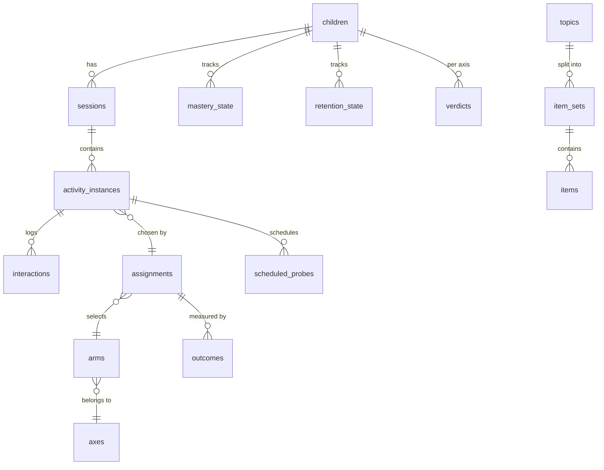

# AURA — Database Schema

SQLite for development (single file, zero setup), PostgreSQL later. Access through
SQLAlchemy + Alembic so the switch is a connection-string change.

**Design rule:** the schema must be able to answer, months later,
*"why did the system show this child this activity, and what happened as a result —
immediately and a week later?"* If a table can't help answer that, it doesn't belong here.

---

## 1. Groups at a glance

```
A. Identity & consent   users, children, guardianships, educator_links, consents
B. Curriculum & content domains, topics, activity_templates, items, item_sets, themes, guides
C. Runtime              sessions, activity_instances, interactions, scheduled_probes,
                        intervention_events
D. Profile state        mastery_state, retention_state, interest_state, modality_state,
                        engagement_state
E. Experiment  ⭐       axes, arms, assignments, outcomes, verdicts, arm_locks,
                        policy_versions
F. Adults               recommendations, overrides
```



---

## 2. A — Identity and consent

### users
| column | type | notes |
|---|---|---|
| id | uuid pk | |
| email | text unique | |
| password_hash | text | |
| role | text | `parent` \| `educator` \| `admin` |
| display_name | text | |
| created_at | timestamptz | |

### children
| column | type | notes |
|---|---|---|
| id | uuid pk | |
| nickname | text | **no full legal name** |
| birth_year_month | text | age band only, e.g. `2019-04` |
| research_hash | text unique | pseudonymous id used in exports |
| created_by | uuid fk users | |
| created_at | timestamptz | |

`guardianships(user_id, child_id, relation)` and
`educator_links(user_id, child_id, role, active)` are simple join tables.

### consents
| column | type | notes |
|---|---|---|
| id | uuid pk | |
| child_id | uuid fk | |
| scope | text | `data_collection` \| `camera` \| `research_use` |
| granted | boolean | |
| granted_by | uuid fk users | |
| granted_at / revoked_at | timestamptz | full history kept, never overwritten |

**Rule:** every export and every camera read checks the *latest* row for that scope.

---

## 3. B — Curriculum and content

### domains
`id, code (literacy|numeracy|communication|cognitive|social_emotional|functional), label, sort_order`

### topics
| column | type | notes |
|---|---|---|
| id | uuid pk | |
| domain_id | uuid fk | |
| code | text | e.g. `num_1_5` |
| label | text | |
| level | text | beginner \| intermediate \| advanced |
| prerequisites | json | list of topic codes |

### activity_templates
`id, topic_id, modality (tap|drag_drop|match|flashcard|voice), method_compatible (json), difficulty_range, config (json)`

### items
| column | type | notes |
|---|---|---|
| id | uuid pk | |
| topic_id | uuid fk | |
| difficulty | int 1–5 | **calibrated, not guessed** — see below |
| answer | json | |
| distractors | json | |
| theme_id | uuid fk themes | null = theme-neutral |
| source | text | `authored` \| `generated` |
| review_status | text | `pending` \| `approved` \| `rejected` |
| reviewed_by | uuid fk users | generated content never reaches a child unreviewed |

### item_sets ⭐
Matched groups used for fair comparisons.

| column | type | notes |
|---|---|---|
| id | uuid pk | |
| topic_id | uuid fk | |
| match_group | text | sets sharing this value are considered equivalent |
| difficulty_mean | float | must be within tolerance across the group |
| size | int | equal across the group |

**Matching rule (enforced in code, tested in CI):** two sets in the same `match_group`
must have equal size, equal difficulty mean within ±0.2, and the same item types.
Without this, every comparison is confounded and the research claim collapses.

### themes / guides
`themes(id, code, label, asset_path)` · `guides(id, theme_id, name, character_type)`

---

## 4. C — Runtime

### sessions
`id, child_id, started_at, ended_at, planned_minutes, actual_minutes, device, app_version, end_reason (completed|child_stopped|adult_stopped|distress|timeout)`

### activity_instances
| column | type | notes |
|---|---|---|
| id | uuid pk | |
| session_id | uuid fk | |
| topic_id | uuid fk | |
| assignment_id | uuid fk | ⭐ links to the decision that produced it |
| item_set_id | uuid fk | |
| spec | json | the exact `ActivitySpec` sent to the device |
| started_at / ended_at | timestamptz | |
| completed | boolean | |
| abandoned | boolean | |

Storing the full spec means an old session can be replayed exactly, even after the
engine changes.

### interactions
The highest-volume table — one row per meaningful touch or response.

| column | type | notes |
|---|---|---|
| id | uuid pk | client-generated, makes uploads idempotent |
| activity_instance_id | uuid fk | |
| item_id | uuid fk | |
| kind | text | `answer` \| `tap` \| `drag` \| `hint_request` \| `idle` \| `abandon` |
| correct | boolean null | null for non-answers |
| response_time_ms | int | from prompt end to first response |
| first_touch_latency_ms | int | hesitation signal |
| attempts | int | |
| hints_used | int | |
| off_target_taps | int | motor signal |
| device_time / server_time | timestamptz | both stored; clock skew matters |
| payload | json | modality-specific detail |

### scheduled_probes
`id, child_id, topic_id, item_set_id, source_assignment_id, due_at, delay_days (3|7|audit), status (pending|delivered|missed), delivered_activity_instance_id`

`source_assignment_id` is how a result days later is attributed back to the teaching
method that produced the original learning.

### intervention_events
`id, session_id, triggered_at, engagement_before, intervention_arm_id, duration_s, engagement_after_60s, assignment_id`

---

## 5. D — Profile state

Current beliefs, rebuildable from raw tables. Kept for fast dashboards.

- **mastery_state** — `child_id, topic_id, p_mastery, sd, trials, last_practised_at, updated_at`
- **retention_state** — `child_id, topic_id, retention_estimate, half_life_days, last_probe_at, next_due_at, revision_priority`
- **interest_state** — `child_id, theme_id, effect_mean, ci_low, ci_high, n_randomized_trials, parent_prior` (parent's initial pick is stored as a *prior*, never as the current value)
- **modality_state** — `child_id, modality, effect_mean, ci_low, ci_high, n_trials`
- **engagement_state** — `child_id, date, mean_engagement, decline_after_minutes, distress_events, recommended_session_minutes`

---

## 6. E — Experiment tables ⭐ (the research core)

### axes
`id, code (teaching_method|modality|theme|practice_structure|difficulty_band|intervention|session_length), label, active_default, max_concurrent_note`

### arms
`id, axis_id, code, label, is_safe_default, requires_review`
Examples: `teaching_method → errorless | try_then_correct`.

### assignments
One row per decision the engine makes. **This is the table that makes the paper possible.**

| column | type | notes |
|---|---|---|
| id | uuid pk | |
| child_id | uuid fk | |
| axis_id | uuid fk | |
| arm_id | uuid fk | the option actually used |
| candidate_arm_ids | json | what else was allowed at that moment |
| decision_type | text | `explore` \| `exploit` \| `locked` \| `safe_fallback` |
| reason | text | short human-readable justification |
| policy_version | text | git sha of the engine |
| random_seed | bigint | makes the draw reproducible |
| posterior_snapshot | json | beliefs *before* the decision |
| distress_level | float | safety input at decision time |
| created_at | timestamptz | |

### outcomes
| column | type | notes |
|---|---|---|
| id | uuid pk | |
| assignment_id | uuid fk | |
| kind | text | `immediate` \| `retention_3d` \| `retention_7d` \| `engagement_60s` \| `distress` |
| value | float | |
| n | int | trials contributing |
| measured_at | timestamptz | |

Separating outcomes by `kind` is what allows one decision to be scored on learning speed
now *and* memory a week later.

### verdicts
`id, child_id, axis_id, winning_arm_id, posterior_mean, ci_low, ci_high, evidence_trials, decided_at, method (evidence|early_prediction), status (provisional|confirmed|reopened), reopened_reason`

### arm_locks
`id, child_id, axis_id, arm_id, locked_by (user), allow (bool), note, created_at`
Educator control over the action space, per your spec's human-in-the-loop requirement.

### policy_versions
`id, git_sha, description, deployed_at` — so results can be grouped by engine version.

---

## 7. F — Adults

- **recommendations** — `id, child_id, kind (revise|introduce|modality|interest|session_length), payload json, generated_at, shown_to (parent|educator), response (accepted|skipped|null), responded_at`
- **overrides** — `id, child_id, user_id, kind (assign_topic|force_arm|block_arm|adjust_difficulty), payload json, created_at, expires_at`

Overrides are logged as data, so the paper can report how often adults disagreed with the
engine — itself an interesting result.

---

## 8. Indexes that matter

```sql
CREATE INDEX ix_interactions_activity      ON interactions(activity_instance_id);
CREATE INDEX ix_activity_session           ON activity_instances(session_id);
CREATE INDEX ix_assignments_child_axis     ON assignments(child_id, axis_id, created_at);
CREATE INDEX ix_outcomes_assignment_kind   ON outcomes(assignment_id, kind);
CREATE INDEX ix_probes_due                 ON scheduled_probes(child_id, status, due_at);
CREATE INDEX ix_mastery_child              ON mastery_state(child_id, topic_id);
```

---

## 9. Queries the schema must be able to answer

These become tests in `backend/tests/test_schema_questions.py`.

1. **Per-child comparison** — for one child and axis, trials and accuracy per arm, plus
   3-day and 7-day retention per arm.
2. **Decision audit** — for any activity, what was chosen, what else was allowed, was it
   explore or exploit, what the beliefs were, and the seed.
3. **Matching check** — for every comparison used in analysis, confirm the arms used sets
   from the same `match_group`.
4. **Safety report** — how many times exploration was blocked by distress, per child.
5. **Attribution** — for any retention probe, which original teaching decision it scores.
6. **Adult disagreement** — how often educators locked or overrode the engine's choice.

Example (question 1):

```sql
SELECT a.arm_id,
       SUM(CASE WHEN o.kind = 'immediate'     THEN o.n ELSE 0 END)     AS trials,
       AVG(CASE WHEN o.kind = 'immediate'     THEN o.value END)        AS accuracy_now,
       AVG(CASE WHEN o.kind = 'retention_7d'  THEN o.value END)        AS retained_7d
FROM assignments a
JOIN outcomes o ON o.assignment_id = a.id
WHERE a.child_id = :child AND a.axis_id = :axis
GROUP BY a.arm_id;
```

---

## 10. Retention and privacy of the data itself

- Raw interaction rows: kept for the research period, then aggregated.
- Camera frames: **never stored**. Only derived scalar signals, and only with consent.
- Export: pseudonymous (`research_hash`), consent-checked, with an export log row.
- Deletion: a guardian request removes the child's rows and their export entries.
